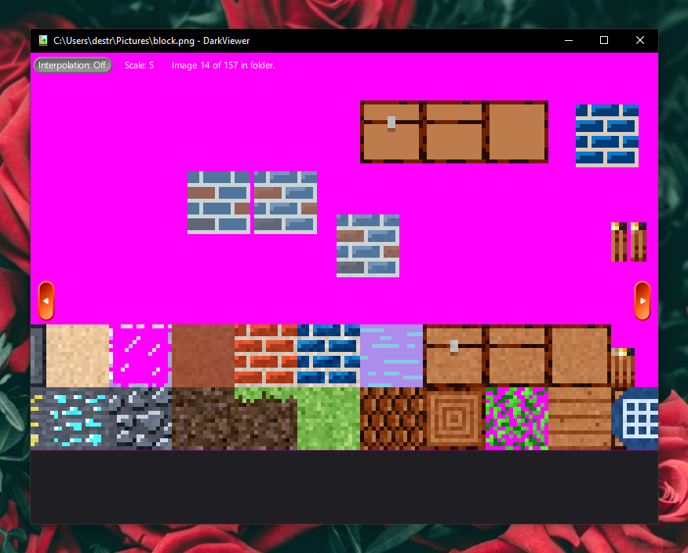
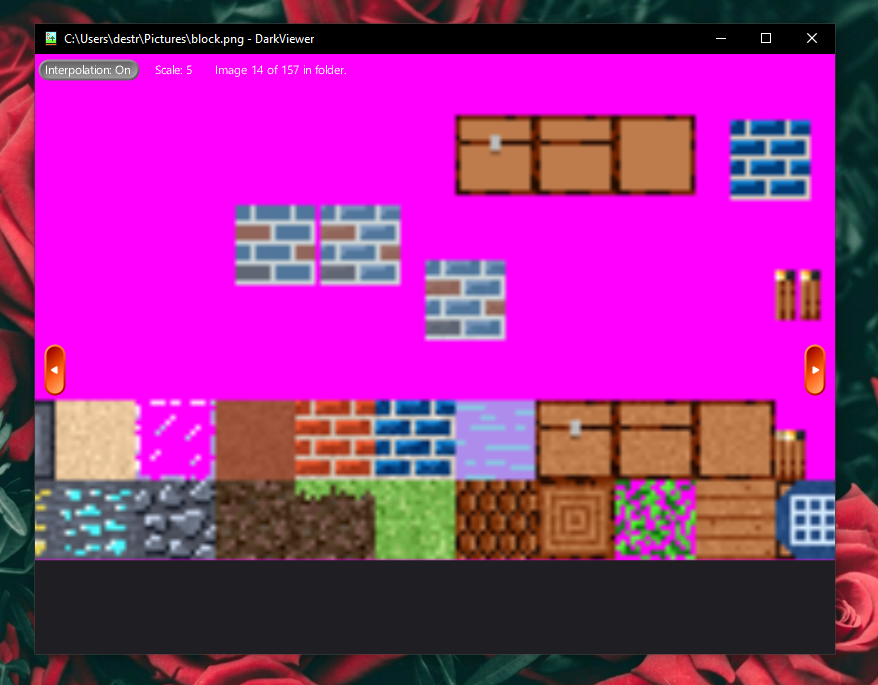

# DarkViewer

## An OpenGL 2.0 image viewer with toggleable interpolation.

## Build:
- Open solution in Visual Studio 2019
- Build DarkEngine, then DarkViewer, then DarkViewerUninstaller, then DarkViewerInstaller